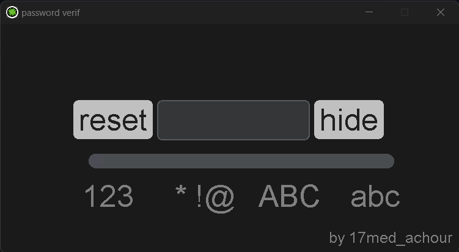

<h1 style="text-align: center;">passowrd verif</h1>

<center></img></center>
<p align="center">Check how secure your password is using a free offline tool.</p>
to install and run

```shell
git clone 
cd password_calcul
python main.py

```

<p align="center"></img></p>


